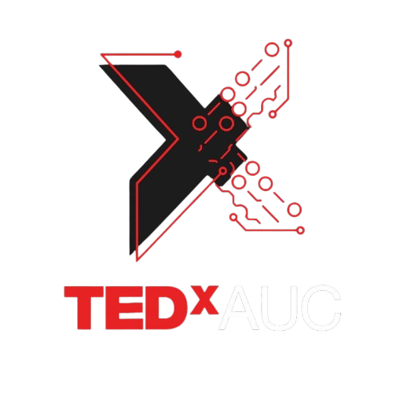

<div align="center">



# TEDx AUC — Event Platform & Autonomous Ticketing Engine

**The official digital platform and high-concurrency ticketing engine for TEDx Amity University Chhattisgarh.**  
Featuring real-time auditorium seat reservations, cryptographic payment reconciliation, serverless automated ticket issuance, and gate QR check-ins.

[](https://ted-x-auc.vercel.app)
[](https://ted-x-auc.vercel.app)
[](https://ted-x-auc.vercel.app)
[-FF9900?style=for-the-badge&logo=checkmarx&logoColor=white)](https://ted-x-auc.vercel.app)
[](https://github.com/Nikhil-Vzo/TedX_Auc/actions)
[](LICENSE)

<br />

<p align="center">
  
  
</p>

</div>

---

## ⚡ At a Glance

| Metric / Dimension | Specification / Result |
| :--- | :--- |
| **Event** | TEDx Amity University Chhattisgarh (`Beyond Boundaries`) |
| **Volume Processed** | **₹40,000+** in automated ticket sales |
| **Payment Success** | **100%** via Razorpay webhook signature verification |
| **Ticket Delivery** | **Zero failed deliveries** — 100% automated via Resend API & Deno Edge Functions |
| **Operational Savings** | **15+ organizer hours saved per week** (eliminated manual UPI & Google Form verification) |
| **Gate Verification** | Instant digital pass & anti-reuse QR validation |

---

## 🎯 Why It Exists

Campus event ticketing typically collapses into chaos:
- Attendees filling out cumbersome Google Forms and uploading manual UPI screenshots over WhatsApp.
- Organizers spending hundreds of hours cross-referencing bank statements, chasing disputed transactions, and manually sending PDF passes.
- High gate friction: long verification queues checking names against static paper spreadsheets, leading to double entries and bottlenecks.

**TEDx AUC replaces that broken workflow with an autonomous production engine.**  
From visual seat selection on a customized AUC auditorium map to millisecond-grade cryptographic payment reconciliation and instant branded email pass delivery, the entire lifecycle runs hands-free.

---

## 🚀 Key Features

| Domain | What it does |
| :--- | :--- |
| **Interactive Auditorium Grid** | Programmatic seating map tailored to the AUC auditorium (Ground Rows A–I, Back Rows J–M, and Upper Balcony UB1–UB3) with real-time seat lock state and double-booking prevention. |
| **Cryptographic Checkout** | Server-side Razorpay order generation with strict HMAC-SHA256 signature verification and automated fail-safe recovery. |
| **Edge Ticket Delivery Pipeline** | Decoupled serverless Supabase Edge Function (Deno) dispatching responsive HTML passes with event metadata via the Resend API. |
| **Attendee Wallet & Gate Pass** | Authenticated user profile dashboard with an interactive ticket wallet displaying live seat allocations and entrance QR codes. |
| **Speaker & Agenda Portal** | High-aesthetic editorial showcase with rich bios for distinguished dignitaries, war veterans, tech founders, and industry leaders. |
| **Real-time Status Polling** | Client-side status reconciliation loop verifying active database records before confirming bookings to prevent UI false positives. |

---

## 🛠️ Tech Stack

```
TEDx AUC System Architecture
┌────────────────────────────────────────────────────────┐
│   Client Layer (React 18 + Vite + Tailwind + shadcn)   │
└─────────────────────────┬──────────────────────────────┘
                          │ HTTPS / REST
         ┌────────────────┴────────────────┐
         ▼                                 ▼
┌──────────────────┐             ┌───────────────────────┐
│  Express Backend │             │   Supabase Services   │
│  (Razorpay Core) │             │ (PostgreSQL Auth+RLS) │
└────────┬─────────┘             └───────────┬───────────┘
         │ Webhook HMAC                      │ Service Auth
         ▼                                   ▼
┌──────────────────┐             ┌───────────────────────┐
│ Razorpay Gateway │             │  Deno Edge Function   │
│ (Order & Escrow) │             │  (Resend API Delivery)│
└──────────────────┘             └───────────────────────┘
```

- **Frontend**: React 18, TypeScript, Vite, Tailwind CSS, shadcn/ui, Radix UI primitives, TanStack Query, Sonner, Heroicons, Lucide React.
- **Backend**: Node.js 20, Express, Razorpay SDK, Native Crypto (`crypto.createHmac`).
- **Serverless & Edge**: Supabase Edge Functions (Deno Runtime), Resend API.
- **Database & Auth**: PostgreSQL (Supabase), Row-Level Security (RLS), Supabase Auth.
- **Deployment**: Vercel (Frontend), Supabase Cloud (Edge & DB), Custom Domain DNS (`tedxamity.com`).

---

## 📂 Repository Structure

```
TedX_Auc/
├── ASSET MOCKUP/                       # High-resolution device presentation mockups
│   ├── TEDx Laptop Hero Mockup.png     # Desktop hero & branding mockup
│   └── TEDx Speakers Laptop Mockup.png # Desktop speakers showcase mockup
├── public/                             # Static web assets & favicon
├── server/                             # Node.js / Express payment gateway microservice
│   ├── index.js                        # Order creation, HMAC webhook, status reconciliation
│   └── package.json                    # Backend dependencies
├── src/                                # Frontend React application
│   ├── assets/                         # Vector branding, speaker portraits, event imagery
│   ├── components/                     # Reusable UI primitives & event ticket components
│   │   ├── TicketCard.tsx              # Digital attendee pass with scannable gate badge
│   │   ├── EventGallery.tsx            # Visual memories and campus highlights
│   │   └── ui/                         # shadcn/ui and Radix design tokens
│   ├── contexts/                       # Authentication and global state
│   ├── integrations/supabase/          # Type-safe Supabase client initialization
│   └── pages/                          # Application routes
│       ├── Index.tsx                   # Main TEDx landing page & speaker lineup
│       ├── EventBooking.tsx            # Visual seat layout selector & payment launcher
│       ├── PaymentStatus.tsx           # Multi-attempt transaction verification poller
│       ├── Profile.tsx                 # Attendee ticket wallet & booking history
│       └── Speakers.tsx                # Speaker bios & talk spotlights
├── supabase/
│   ├── config.toml                     # Supabase project configuration
│   └── functions/
│       └── send-booking-email-secure/  # Deno Edge Function for automated ticket dispatch
├── tailwind.config.ts                  # Brand theme tokens & animations
└── package.json                        # Root frontend configuration
```

---

## 🧠 Engineering Highlights

Real architectural problems and their concrete production solutions:

### 1. Webhook Idempotency & Raw-Body HMAC-SHA256 Verification
Razorpay webhooks can retry across network drops. A naive webhook handler can cause duplicated ticket entries and multiple debits/emails.
- **Root cause isolation**: Express JSON body parsers alter byte sequences, breaking HMAC signature validation.
- **Fix**: Implemented custom `express.json({ verify: (req, res, buf) => { req.rawBody = buf.toString(); } })` middleware. Signatures are verified strictly against `req.rawBody`.
- **Database Idempotency**: Enforced unique constraints on `razorpay_order_id` in PostgreSQL. When Razorpay retries an already processed payment, Supabase throws duplicate code `23505`, which the service intercepts gracefully and returns `200 OK` without triggering duplicate email jobs.

### 2. Decoupled Edge Email Pipeline
Sending rich HTML ticket emails synchronously within the webhook handler introduces high latency and risks webhook timeouts from Razorpay.
- **Solution**: The webhook worker writes the booking to PostgreSQL and immediately fires an asynchronous event to an isolated Supabase Deno Edge Function (`send-booking-email-secure`) authenticated via `SUPABASE_SERVICE_KEY` and secret query param validation. Razorpay gets a `<200ms` acknowledgement, while the user receives their high-fidelity Resend email reliably.

### 3. Non-Uniform Auditorium Grid Engine
Standard event booking tools assume a symmetric rectangular matrix. Amity University Chhattisgarh's auditorium has asymmetrical seating tiers:
- **Ground Floor**: Rows A through I have 28 seats each.
- **Rear Tiers**: Rows J through M have 22 seats each, plus specialized last-row offsets.
- **Upper Balcony**: UB1, UB2, and UB3 have 22 seats each.
- **Implementation**: Engineered a programmatic layout generator that queries Supabase `bookings.selected_seats`, flattens all reserved tickets into a hash set for `O(1)` availability checking, and handles real-time seat lock toggling without UI lag.

### 4. Zero-Trust Client Payment Verification
Client-side payment callbacks cannot be trusted for ticket generation.
- When the Razorpay modal completes or dismisses, the client routes to `/payment-status/:orderId`.
- The client initiates an exponential retry polling loop against the backend endpoint `/api/payment/booking-status/:orderId`.
- The status endpoint checks the database for `is_ticket_active = true` (only written by the authenticated webhook). The frontend never issues or marks a ticket active on its own.

---

## 🔒 Security Posture

- **Cryptographic Webhook Authentication**: Every webhook payload must pass an HMAC-SHA256 digest check matching `RAZORPAY_WEBHOOK_SECRET`.
- **Zero Exposed Secrets**: `RAZORPAY_KEY_SECRET`, `SUPABASE_SERVICE_KEY`, and `RESEND_API_KEY` are strictly confined to server-side environments and edge function secrets.
- **Strict CORS Policy**: The Express payment server restricts inbound requests to explicitly whitelisted origins (`tedxamity.com`, `ted-x-auc.vercel.app`, and `localhost:8080`).
- **Row Level Security (RLS)**: Public client access to `bookings` tables is gated; write access is restricted to verified backend service execution.

---

## 💻 Running Locally

### 1. Prerequisites
- **Node.js**: v18.0.0 or higher
- **npm** or **bun**
- **Supabase Account & CLI** (optional for local edge functions)

### 2. Clone & Install Frontend
```bash
git clone https://github.com/Nikhil-Vzo/TedX_Auc.git
cd TedX_Auc

# Install frontend dependencies
npm install

# Start Vite development server
npm run dev
```

### 3. Configure Frontend Environment Variables
Create `.env` in the root directory:
```env
VITE_SUPABASE_URL=https://your-supabase-project.supabase.co
VITE_SUPABASE_ANON_KEY=your-supabase-anon-key
VITE_API_BASE_URL=http://localhost:3001
```

### 4. Start Payment Backend
```bash
cd server
npm install

# Start Express server
npm start
```

Configure `server/.env`:
```env
PORT=3001
RAZORPAY_KEY_ID=your_razorpay_key_id
RAZORPAY_KEY_SECRET=your_razorpay_key_secret
RAZORPAY_WEBHOOK_SECRET=your_razorpay_webhook_secret
SUPABASE_URL=https://your-supabase-project.supabase.co
SUPABASE_SERVICE_KEY=your_supabase_service_role_key
EMAIL_WEBHOOK_SECRET=your_edge_function_secret
```

### 5. Deploy Edge Function (Optional)
```bash
supabase functions deploy send-booking-email-secure --no-verify-jwt
```

---

## 👥 Credits & Ownership

**Built for TEDx Amity University Chhattisgarh (AUC)**  
Organized at Amity University Raipur under official license from TED.

<br />

<div align="center">
  
**Engineered by Nikhil Yadav**  
Founder of [OthrHalff](https://www.othrhalff.in/) · [Portfolio](https://portfolio-alpha-ebon-0d63biy00d.vercel.app/) · [GitHub](https://github.com/Nikhil-Vzo)

<p align="center">
  <sub>This independent TEDx event is operated under license from TED.</sub>
</p>

</div>
